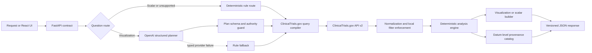
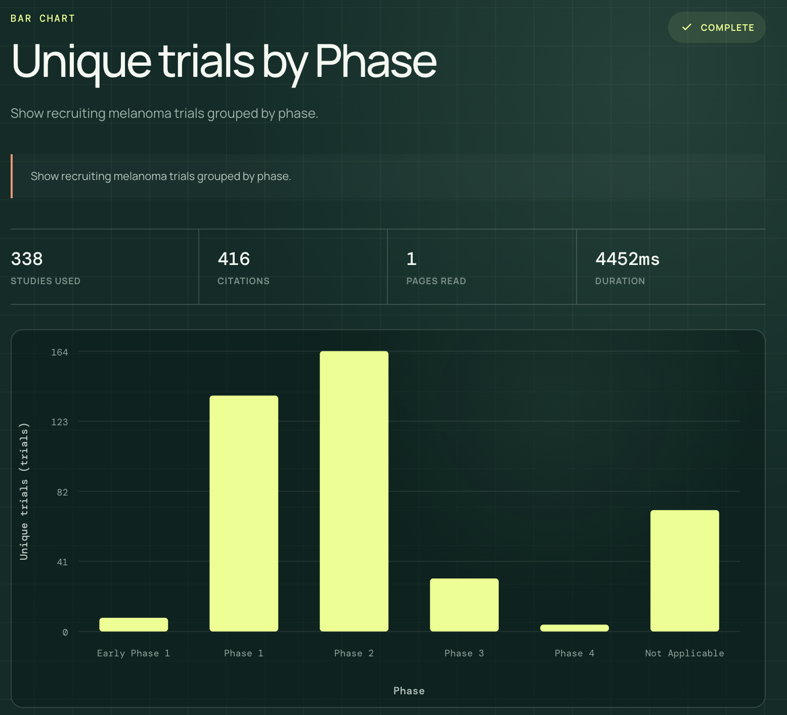
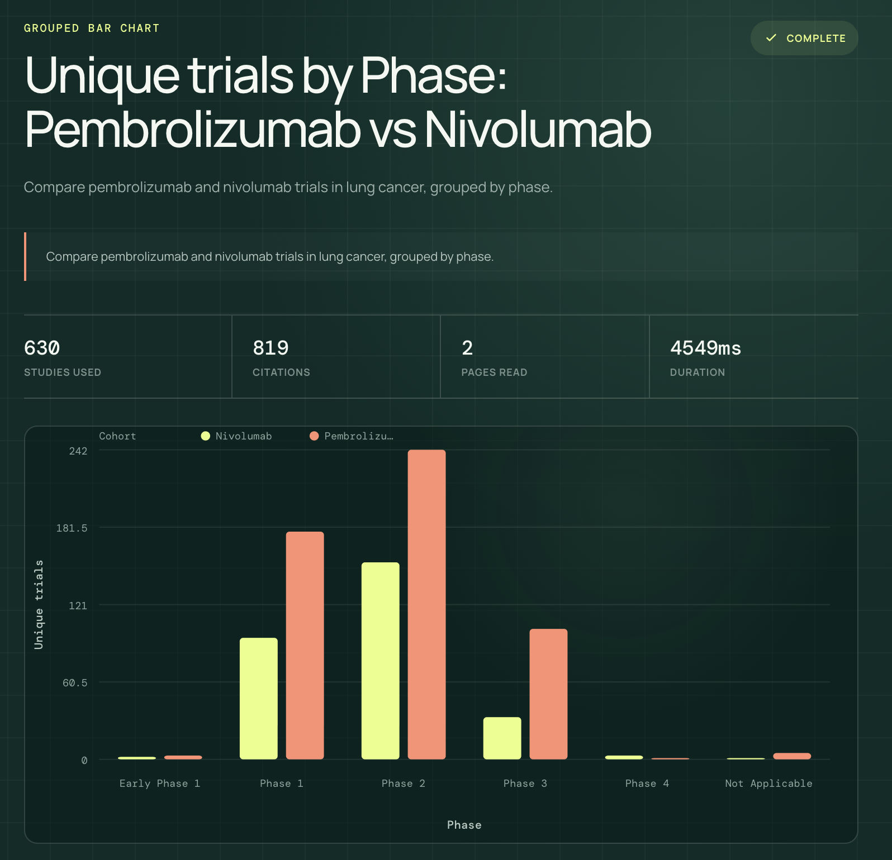
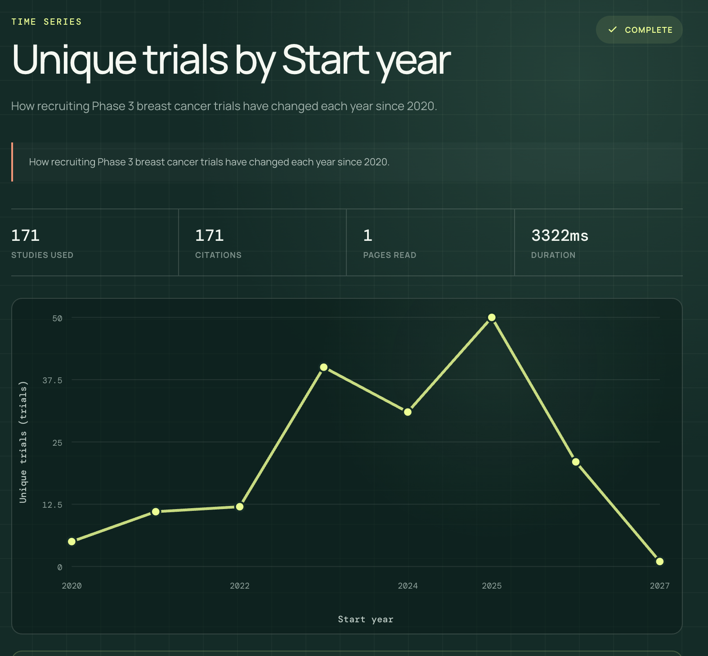
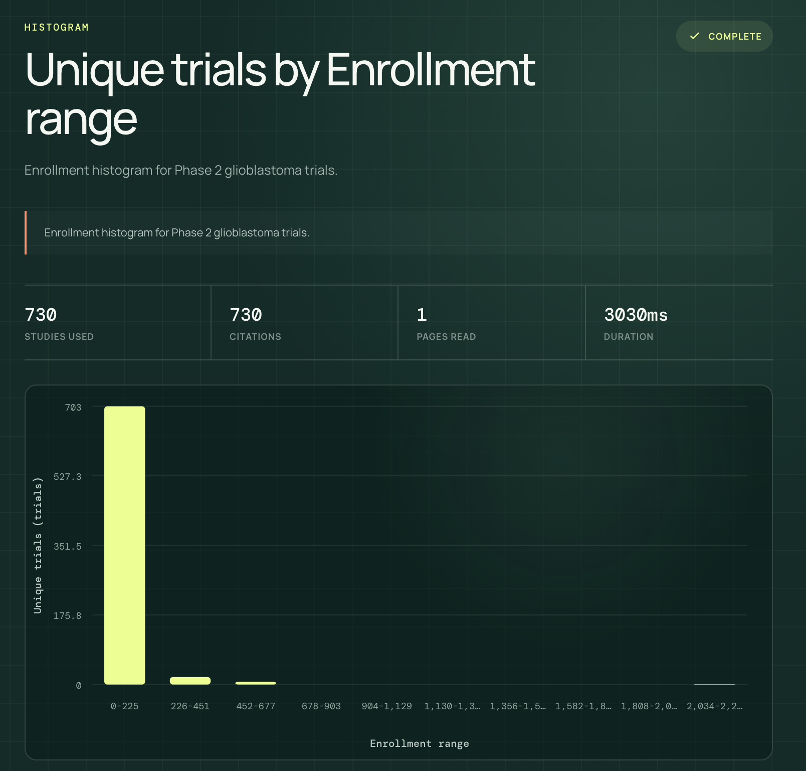
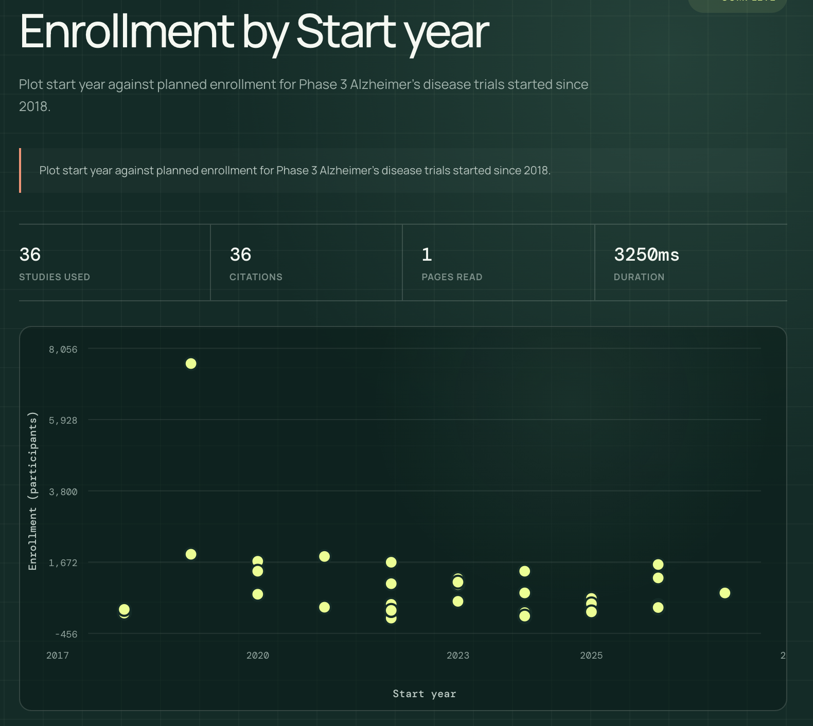
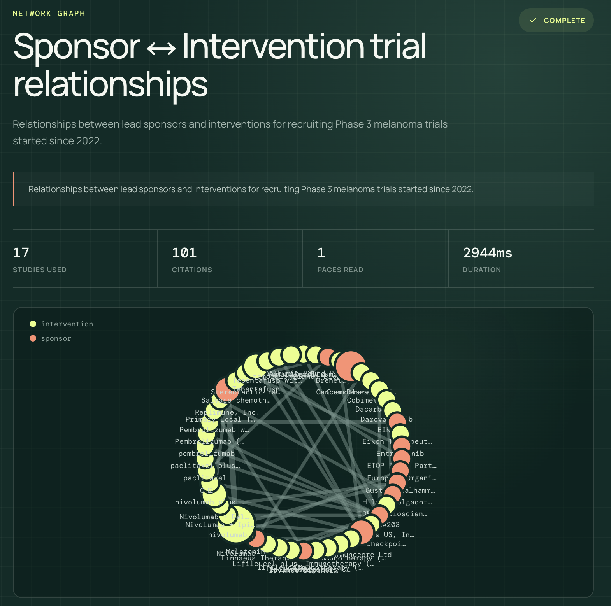
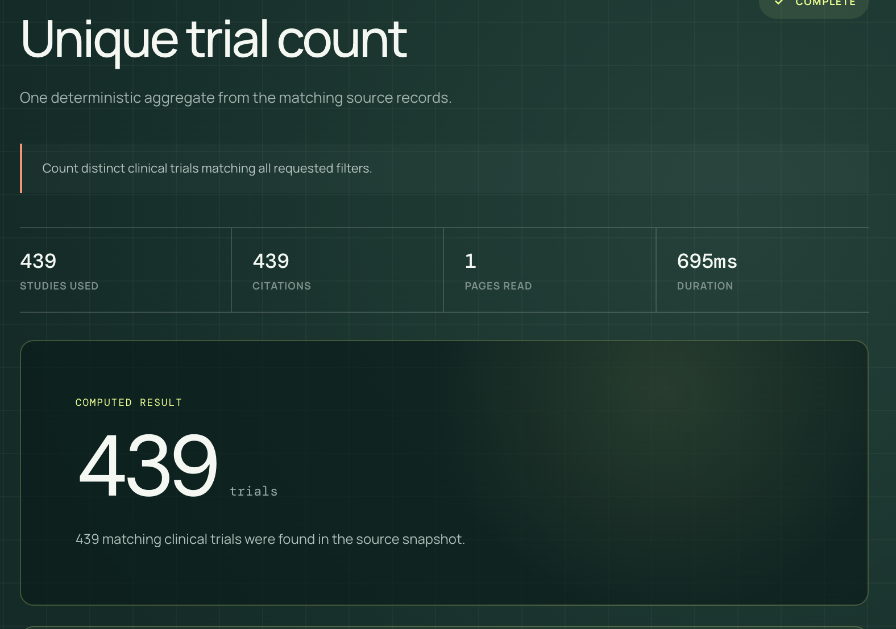

# Cheiron

Cheiron is an AI-assisted ClinicalTrials.gov query-to-visualization service. It
accepts a natural-language clinical-trial question, produces a constrained
semantic analysis plan, retrieves authoritative records from the
[ClinicalTrials.gov Data API](https://clinicaltrials.gov/data-api/api), and
returns a versioned JSON response that a frontend can render without guessing.

The repository also includes a React demo. In addition to visualization
questions, Cheiron deliberately supports bounded scalar questions such as
"How many recruiting melanoma trials are there?" Questions requiring medical
advice, efficacy judgments, causality, or prognosis are rejected as unsupported.

## Demo

[Watch the Cheiron application demo](demo/Cheiron_demo.mov) (1 minute 54 seconds,
no audio). The recording demonstrates natural-language clinical-trial queries,
multiple visualization types, datum-level ClinicalTrials.gov provenance, and a
safe pivot from an unsupported medical-advice request to supported trial
analysis.

## What is implemented

- Bar and grouped-bar charts
- Time-series charts
- Histograms
- Scatter plots
- Sponsor/intervention/condition/country network graphs
- Geographic, distribution, comparison, trend and relationship analyses
- Deterministic scalar counts, total enrollment and average enrollment
- Optional structured filters that take precedence over natural-language values
- Datum-level ClinicalTrials.gov citations with exact field/value evidence
- Typed clarification, unsupported-question and provider/source failure responses
- Condition-aware safe pivots from medical-advice requests to supported trial analyses
- Pagination, study limits, normalization warnings and completeness metadata
- A frontend that renders every supported chart and exposes citation evidence

## Quick start

### Requirements

- Python 3.12+
- [uv](https://docs.astral.sh/uv/)
- Node.js 24 LTS and npm for the optional frontend
- An OpenAI API key with access to `gpt-5.4-mini`, or another compatible model

### Install and configure

```bash
git clone https://github.com/nanda1045/Cheiron_Assignment.git
cd Cheiron_Assignment
uv sync --all-extras
cp .env.example .env
```

Edit `.env` locally:

```dotenv
CHEIRON_ENVIRONMENT=development
CHEIRON_LOG_LEVEL=INFO
CHEIRON_PLANNER_PROVIDER=openai
CHEIRON_OPENAI_MODEL=gpt-5.4-mini
OPENAI_API_KEY=your-key-here
```

`.env` is ignored by Git. The model receives the question, structured filters
and output controls needed to construct a plan. Retrieved ClinicalTrials.gov
study records are not sent to OpenAI, and planner responses are requested with
`store=False`.

### Start the backend

```bash
uv run uvicorn cheiron.main:app --reload
```

The API is available at `http://localhost:8000`. Interactive OpenAPI
documentation is available at `http://localhost:8000/docs`.

Operational endpoints:

- `GET /health`: process-level service health
- `GET /ready`: effective planner and credential readiness
- `POST /v1/query`: execute a clinical-trial question

### Start the frontend

In a second terminal:

```bash
cd frontend
npm ci
npm run dev
```

Open `http://localhost:5173`. The Vite development server proxies `/v1`,
`/health` and `/ready` to `http://127.0.0.1:8000`.

## Request contract

`POST /v1/query` accepts `application/json`. Unknown fields are rejected.

### Top-level request

| Field | Type | Required | Validation and meaning |
| --- | --- | --- | --- |
| `schema_version` | string | No | Fixed to `"1.0"`; defaults to `"1.0"` |
| `query` | string | Yes | Natural-language question; 3–2,000 characters |
| `filters` | object | No | Authoritative structured constraints; defaults to `{}` |
| `options` | object | No | Citation, visualization and retrieval controls |

Structured filters are authoritative. For example, if
`filters.conditions=["Melanoma"]` conflicts with a condition mentioned in
`query`, the structured value is preserved and enforced by an application-side
plan guard.

### `filters`

| Field | Type | Limits / allowed values |
| --- | --- | --- |
| `conditions` | string[] | Up to 10 condition names |
| `interventions` | string[] | Up to 10 drug/intervention names |
| `phases` | string[] | Up to 6: `EARLY_PHASE1`, `PHASE1`–`PHASE4`, `NA` |
| `statuses` | string[] | Up to 10 ClinicalTrials.gov recruitment statuses |
| `sponsors` | string[] | Up to 10 lead-sponsor names |
| `sponsor_classes` | string[] | Up to 8: `NIH`, `FED`, `OTHER_GOV`, `INDIV`, `INDUSTRY`, `NETWORK`, `OTHER`, `UNKNOWN` |
| `countries` | string[] | Up to 20 country names |
| `study_types` | string[] | Up to 3: `INTERVENTIONAL`, `OBSERVATIONAL`, `EXPANDED_ACCESS` |
| `start_year_from` | integer or null | 1900–2100 |
| `start_year_to` | integer or null | 1900–2100 and not earlier than `start_year_from` |

Supported recruitment statuses are `ACTIVE_NOT_RECRUITING`, `COMPLETED`,
`ENROLLING_BY_INVITATION`, `NOT_YET_RECRUITING`, `RECRUITING`, `SUSPENDED`,
`TERMINATED`, `WITHDRAWN` and `UNKNOWN`.

### `options`

| Field | Type | Default | Validation and meaning |
| --- | --- | --- | --- |
| `include_citations` | boolean | `true` | Attach datum-level evidence references |
| `preferred_visualization` | string or null | `null` | One supported visualization type; incompatible choices produce clarification |
| `max_studies` | integer or null | server default | 1–100,000; the server applies its configured cap, currently 20,000 |

Supported visualization values are `bar_chart`, `grouped_bar_chart`,
`time_series`, `histogram`, `scatter_plot` and `network_graph`.

### Example request

```bash
curl --request POST http://localhost:8000/v1/query \
  --header 'Content-Type: application/json' \
  --data '{
    "schema_version": "1.0",
    "query": "How have recruiting Phase 3 breast cancer trials changed each year since 2020?",
    "filters": {
      "conditions": ["Breast Cancer"],
      "phases": ["PHASE3"],
      "statuses": ["RECRUITING"],
      "start_year_from": 2020
    },
    "options": {
      "include_citations": true,
      "max_studies": 20000
    }
  }'
```

## Response contract

Every response has `schema_version`, `request_id` and a discriminating `status`.
The API exposes four application outcomes: success, clarification required,
unsupported question and error.

### Successful response

| Field | Type | Meaning |
| --- | --- | --- |
| `schema_version` | `"1.0"` | Public contract version |
| `request_id` | UUID | Correlates UI output and logs |
| `status` | `"ok"` | Successful execution |
| `result_type` | `visualization` or `scalar_answer` | Selects the result payload |
| `query` | object | Original question, interpretation, precedence disclosure and warnings |
| `plan` | object | Validated semantic plan executed by deterministic code |
| `visualization` | object or null | Present only for visualization results |
| `answer` | object or null | Present only for scalar results |
| `provenance` | object | Source metadata and citation catalog |
| `meta` | object | Planner, counts, completeness, duration and warnings |

Exactly one of `visualization` and `answer` is present, and it must agree with
both `result_type` and `plan.output_type`.

### Cartesian visualization

Bar, grouped-bar, time-series, histogram and scatter results share this shape:

```json
{
  "type": "bar_chart",
  "title": "Human-readable title",
  "description": "What the chart represents",
  "encoding": {
    "x": {
      "field": "phase",
      "data_type": "ordinal",
      "title": "Phase",
      "unit": null,
      "sort": ["Phase 1", "Phase 2", "Phase 3", "Phase 4"]
    },
    "y": {
      "field": "trial_count",
      "data_type": "quantitative",
      "title": "Trial count",
      "unit": "trials",
      "sort": null
    },
    "color": null,
    "size": null
  },
  "data": {
    "kind": "tabular",
    "records": [
      {
        "id": "stable-datum-id",
        "values": {"phase": "Phase 3", "trial_count": 41},
        "citation_ids": ["cit-nct01234567-example"]
      }
    ]
  }
}
```

Each channel contains a render field, data type, title, optional unit and sort
instruction. `color` carries the cohort series for grouped comparisons. `size`
is available for quantitative point sizing.

### Network visualization

```json
{
  "type": "network_graph",
  "title": "Sponsor–intervention relationships",
  "description": "Lead sponsors connected to interventions in matching trials.",
  "encoding": {
    "node_id": "id",
    "node_label": "label",
    "node_group": "entity_type",
    "node_size": "value",
    "edge_source": "source",
    "edge_target": "target",
    "edge_weight": "weight"
  },
  "data": {
    "kind": "network",
    "nodes": [
      {
        "id": "sponsor:example-pharma",
        "label": "Example Pharma",
        "entity_type": "sponsor",
        "value": 1,
        "citation_ids": ["cit-nct01234567-example"]
      },
      {
        "id": "intervention:pembrolizumab",
        "label": "Pembrolizumab",
        "entity_type": "intervention",
        "value": 1,
        "citation_ids": ["cit-nct01234567-example"]
      }
    ],
    "edges": [
      {
        "id": "stable-edge-id",
        "source": "sponsor:example-pharma",
        "target": "intervention:pembrolizumab",
        "weight": 1,
        "citation_ids": ["cit-nct01234567-example"]
      }
    ]
  }
}
```

Every edge endpoint is guaranteed to reference a returned node. Supported
network entities are sponsor, intervention, condition and country.

### Scalar answer

Scalar answers use deterministic aggregation over one filtered cohort:

```json
{
  "kind": "scalar",
  "title": "Unique trial count",
  "text": "1 matching clinical trial was found in the source snapshot.",
  "value": 1,
  "unit": "trials",
  "citation_ids": ["cit-nct01234567-example"]
}
```

Supported scalar measures are distinct/count trials, total planned enrollment
and average planned enrollment.

### Deep citations and provenance

Each rendered datum carries `citation_ids`. Those IDs resolve through
`provenance.citations`:

```json
{
  "source": {
    "name": "ClinicalTrials.gov",
    "api_version": "2.x",
    "data_timestamp": "2026-07-31T00:00:00Z",
    "retrieved_at": "2026-07-31T00:01:00Z",
    "endpoint": "https://clinicaltrials.gov/api/v2/studies"
  },
  "citations": {
    "cit-nct01234567-example": {
      "id": "cit-nct01234567-example",
      "nct_id": "NCT01234567",
      "study_url": "https://clinicaltrials.gov/study/NCT01234567",
      "evidence": [
        {
          "field_path": "protocolSection.designModule.phases",
          "value": ["PHASE3"]
        }
      ]
    }
  }
}
```

Evidence is not model-written prose. It is copied from specific normalized
ClinicalTrials.gov field/value pairs that contributed to the datum. Aggregated
bars, time buckets, histogram bins, network nodes/edges and scalar answers all
reference their contributing trials. Set `include_citations=false` to omit the
catalog and references without changing analytical values.

### Metadata

`meta.planner` discloses the planner mode, model and whether a limited fallback
was used. `meta.record_counts` reports provider matches, records retrieved,
unique trials used and records excluded during normalization or analysis.
`meta.completeness` reports whether retrieval completed, pages read and any
truncation reason. `duration_ms` is end-to-end backend duration.

### Non-success outcomes

Clarification and unsupported-question outcomes are normal HTTP 200 application
responses:

```json
{
  "schema_version": "1.0",
  "request_id": "00000000-0000-0000-0000-000000000000",
  "status": "clarification_required",
  "clarification": {
    "question": "Which two interventions should be compared?",
    "missing_fields": ["filters.interventions"],
    "suggestions": ["Compare pembrolizumab and nivolumab by phase."]
  }
}
```

```json
{
  "schema_version": "1.0",
  "request_id": "00000000-0000-0000-0000-000000000000",
  "status": "unsupported",
  "reason": "Cheiron can analyze registered trial metadata, but it cannot provide medical advice or infer treatment efficacy, safety, causality, or prognosis.",
  "suggestions": [
    "Show recruiting melanoma trials by phase.",
    "Show melanoma trials by intervention type.",
    "Which sponsors lead melanoma trials?"
  ]
}
```

Errors use `status="error"` and include a stable `error.code`, safe message,
`retryable` flag and structured context. Relevant status/code pairs include:

| HTTP | Code | Meaning |
| --- | --- | --- |
| 422 | `invalid_request` | Request schema validation failed |
| 422 | `query_too_broad` | Complete retrieval would exceed the study cap |
| 422 | `analysis_failed` | The validated analysis could not execute safely |
| 502 | `planner_request_rejected` | Provider rejected the structured planning contract |
| 502 | `planner_invalid_response` | Provider returned no usable structured decision |
| 502 | `source_rejected_query` | ClinicalTrials.gov rejected the compiled query |
| 502 | `source_contract_error` | Source response was incomplete or invalid |
| 503 | `planner_not_configured` | OpenAI credentials are absent or invalid |
| 503 | `planner_unavailable` | OpenAI is temporarily unavailable |
| 503 | `source_unavailable` | ClinicalTrials.gov is temporarily unavailable |
| 500 | `internal_error` | Unexpected internal failure |

## Architecture



The model is a planner, not a data analyst. It selects an allow-listed intent,
cohorts, dimensions, measure and visualization through Pydantic Structured
Outputs. Application code then validates authoritative controls, compiles source
queries, normalizes records, calculates values and attaches evidence. This keeps
model output away from arbitrary API parameters, arithmetic and citations.

### Repository structure

```text
src/cheiron/
├── api/               # FastAPI routes, dependencies and public errors
├── application/       # Runtime wiring and query orchestration
├── planning/          # OpenAI planner, rule routes, guards and contracts
├── clinical_trials/   # API client, query compiler and normalization
├── analysis/          # Filtering, aggregation, scalar and chart analyses
├── visualization/     # Frontend-renderable specifications
├── provenance/        # Stable citation IDs and exact evidence fields
├── evaluation/        # Semantic and deterministic evidence evaluators
└── domain/            # Versioned Pydantic request/response models

frontend/src/
├── api/               # Typed client contracts
└── components/        # Query UI, renderers and evidence inspector
```

## Key design decisions and trade-offs

### Constrained model planning

OpenAI returns a strict `ModelPlannerEnvelope`; arbitrary fields and API syntax
cannot enter the execution path. A plan guard rejects changes to structured
filters or incompatible preferred visualizations. One repair request is allowed
for invalid output, after which Cheiron returns an actionable clarification.

Trade-off: the contract supports fewer operations than unrestricted code
generation, but failures are bounded, testable and safe to render.

### Deterministic retrieval and analysis

ClinicalTrials.gov filtering is pushed upstream when safely expressible, then
reapplied to normalized records before aggregation. Counts are distinct by NCT
ID, duplicate locations or repeated interventions cannot inflate them, partial
dates retain precision, and missing analytical fields are excluded explicitly.

Trade-off: local revalidation costs some processing but protects correctness
from source-query differences and malformed real-world records.

### Explicit cohorts and visualization grammar

Comparisons use separate named cohorts rather than asking the frontend to infer
series. The same analysis engine supports categorical distributions, trends,
geography, histograms, scatter points and networks. Visualization builders emit
channels and data rather than executable frontend code.

Trade-off: the visualization grammar is intentionally closed. Adding a chart
requires a domain type, analysis shape, renderer and tests, but existing clients
never receive an undocumented shape.

### Datum-level provenance

Evidence is constructed from records after analysis. Citation IDs are stable for
a datum, NCT ID and evidence-path combination, and each visual value points to
the exact contributing source fields.

Trade-off: aggregate results can contain many citation references. The request
can disable them when payload size matters.

### Failure policy and fallback

Missing credentials, provider rejection, transient outages, invalid model output
and ClinicalTrials.gov failures have distinct typed responses. `auto` planner
mode can fall back to the deliberately smaller rule grammar for model/API
failures, but clarifications and unsupported questions are never hidden.

Medical-advice, efficacy, safety, causality and prognosis questions return a
typed `unsupported` response rather than a hard error. When the condition is
available from authoritative filters or can be parsed safely, the response
offers clickable, condition-specific pivots such as “Show recruiting melanoma
trials by phase.” The alternative is never executed without the user's choice.

## Validation and evaluation

Correctness is checked at separate boundaries rather than through screenshots
or model judgment alone.

### Deterministic quality gates

```bash
uv run pytest
uv run ruff check .
uv run mypy src scripts

cd frontend
npm run lint
npm test -- --run
npm run build
```

Current reviewed state:

- 122 backend tests
- 23 frontend tests
- Ruff linting passes
- Strict mypy checking passes
- TypeScript production build passes

The tests cover request/response validation, query compilation, pagination and
limits, normalization, filter precedence, every analysis type, renderer
contracts, failure mapping and frontend evidence interaction.

### Live semantic planner evaluation

```bash
uv run python scripts/run_planner_evals.py --min-pass-rate 0.90
```

The curated suite checks route, intent, visualization, dimensions, measures,
cohorts, relationship entities and required/forbidden filters. The reviewed
`gpt-5.4-mini` baseline passed 16/16 cases and 130/130 semantic assertions. It is
a live, model-dependent evaluation and consumes API credits; the report records
observed plans and clarification details so failures remain auditable.

### Deterministic evidence evaluation

```bash
uv run python scripts/run_evidence_evals.py
```

This offline suite executes fixed plans against frozen ClinicalTrials.gov
fixtures and requires 100%. The reviewed baseline passed 8/8 cases and 127/127
checks. It proves exact analytical values, citation resolution, used-versus-cited
NCT consistency, evidence field/value equality, count/citation cardinality and
value invariance when citations are disabled. Dataset and fixture SHA-256 hashes
are stored with both reviewed baselines under `evals/baselines/`.

Evaluation design and reproduction details are in [`evals/README.md`](evals/README.md).

## Supported scope and limitations

- Cheiron analyzes registered ClinicalTrials.gov metadata; it does not determine
  treatment efficacy or safety and does not provide medical advice.
- Natural-language coverage is broad but bounded by the semantic plan vocabulary.
  Ambiguous or conflicting requests may require clarification.
- Model-backed planning is nondeterministic. Strict schemas, guards, repair,
  fallbacks and live regression evals reduce—but cannot eliminate—provider
  variability.
- Network graphs currently support sponsor, intervention, condition and country,
  not investigator or site entities.
- The source is live and can change between runs. Responses disclose the source
  data timestamp, retrieval time, record counts and completeness.
- Queries that cannot be retrieved completely within the configured study cap
  fail explicitly rather than returning an undisclosed partial answer.
- The service has no persistent cache, background job queue, user accounts,
  distributed rate limiter or production deployment configuration.
- The demo frontend is optimized for evaluation and exploration, not accessibility
  certification or every mobile/browser combination.

With more time, the next improvements would be ontology-backed clinical entity
normalization, cached/versioned source snapshots, repeated stability evals across
model snapshots, asynchronous execution for very broad queries, more network
entities, production authentication/rate limiting and deployment observability.

## AI tools and development integrity

### Tools used

- OpenAI `gpt-5.4-mini` is the final runtime semantic planner through the
  Responses API and Pydantic Structured Outputs.
- OpenAI Codex was used as a collaborative engineering tool for repository
  inspection, architecture discussion, code drafting/refactoring, test and eval
  generation, debugging and documentation.
- An early development iteration used Anthropic Claude for structured planning;
  it was replaced by OpenAI and is not a final dependency.
- FastAPI, Pydantic, httpx, uv, pytest, respx, Ruff and mypy support the backend.
- React, TypeScript, Vite, Vitest and Testing Library support the demo frontend.
- Official ClinicalTrials.gov and provider documentation were used for API and
  SDK contracts.

### Deliberately designed versus generated and adapted

The architecture and safety boundaries were deliberate: semantic-plan ownership,
authoritative structured filters, model/data separation, allow-listed query
compilation, deterministic aggregation, distinct-study counting, datum-level
provenance, typed failure policy, completeness disclosure and layered evaluation.
The request/response grammar and frontend renderer contract were shaped around
the assignment requirement that a frontend engineer should not need to guess.

Codex assisted in generating and adapting implementation code, tests, evaluator
scaffolding, frontend styling and documentation. Generated suggestions were not
accepted as correctness evidence by themselves: changes were inspected against
the domain contracts, exercised with recorded source fixtures, checked by static
analysis, run through automated tests and iterated using live semantic failures.
The commit history intentionally preserves those feature and regression steps.

## Example runs

The following examples were executed against the live service on 2026-08-01 UTC.
Every linked file is the complete, actual backend JSON response—not a hand-written
fixture. The six visual runs cover every supported visualization type; the final
run demonstrates that a question needing only one value returns a scalar answer.

| Output | Query | Studies used | Citation-enabled UI run | Actual JSON |
| --- | --- | ---: | ---: | --- |
| Bar chart | `Show recruiting melanoma trials by phase.` | 338 | 416 citations | [`bar-chart.json`](docs/examples/bar-chart.json) |
| Grouped bar | `Compare pembrolizumab and nivolumab trials in lung cancer by phase.` | 630 | 819 citations | [`grouped-bar-chart.json`](docs/examples/grouped-bar-chart.json) |
| Time series | `How have recruiting Phase 3 breast cancer trials changed each year since 2020?` | 171 | 171 citations | [`time-series.json`](docs/examples/time-series.json) |
| Histogram | `Plot an enrollment histogram for Phase 2 glioblastoma trials.` | 730 | 730 citations | [`histogram.json`](docs/examples/histogram.json) |
| Scatter plot | `Plot start year against planned enrollment for Phase 3 Alzheimer's disease trials started since 2018.` | 36 | 36 citations | [`scatter-plot.json`](docs/examples/scatter-plot.json) |
| Network graph | `Show relationships between lead sponsors and interventions for recruiting Phase 3 melanoma trials started since 2022.` | 17 | 101 citations | [`network-graph.json`](docs/examples/network-graph.json) |
| Scalar answer | `How many recruiting melanoma trials are there?` | 439 | 439 citations | [`scalar-answer.json`](docs/examples/scalar-answer.json) |

The stored examples use `include_citations=false` to keep the full responses
reviewable. The UI runs used citations, as reflected in the table. Disabling
citations removes only citation references and the catalog; deterministic
analytical values remain identical, which is tested explicitly by the evidence
evaluation suite. See the [example capture notes](docs/examples/README.md) for
source-version and reproducibility details.

### Frontend demo gallery

The screenshots below are citation-enabled frontend runs of the same queries.
Expand an example to inspect the rendered result and its execution metadata.

<details>
<summary>Bar chart — recruiting melanoma trials by phase</summary>



</details>

<details>
<summary>Grouped bar chart — pembrolizumab versus nivolumab by phase</summary>



</details>

<details>
<summary>Time series — recruiting Phase 3 breast cancer trials by start year</summary>



</details>

<details>
<summary>Histogram — Phase 2 glioblastoma trial enrollment</summary>



</details>

<details>
<summary>Scatter plot — Phase 3 Alzheimer's trials by start year and enrollment</summary>



</details>

<details>
<summary>Network graph — melanoma trial sponsors and interventions</summary>



</details>

<details>
<summary>Scalar answer — recruiting melanoma trial count</summary>



</details>
